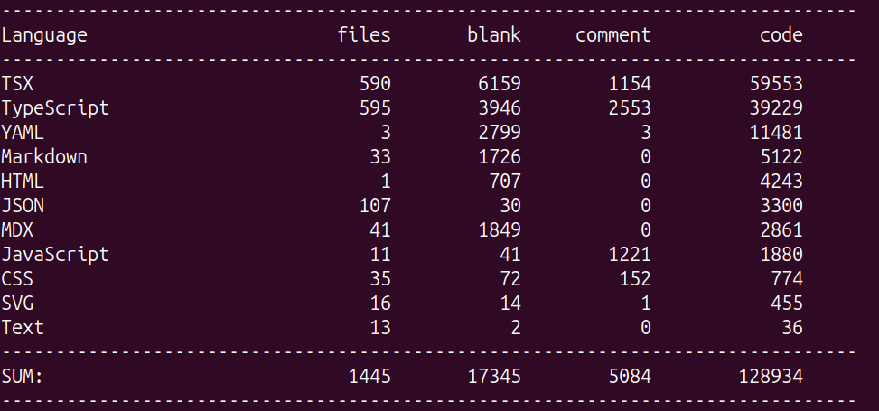

# zcloc

A modern, fast, `cloc`-compatible code counter written in Zig.

`zcloc` counts code lines across many programming languages. It is designed as a drop-in replacement for [`cloc`](https://github.com/AlDanial/cloc) with significant performance improvements and extended features.




## Installation

### From source

```bash
git clone https://github.com/zigmatic/zcloc.git
cd zcloc
zig build -Doptimize=ReleaseFast
```

The binary is at `zig-out/bin/zcloc`.

### Install script

```bash
./install.sh              # installs to ~/.local/bin
./install.sh /usr/local   # installs to /usr/local/bin
PREFIX=/opt ./install.sh  # installs to /opt/bin
```

The script auto-downloads Zig 0.16.0 if not already installed, builds the release binary, copies it to the install prefix, and cleans up build artifacts.

### Requirements

- Zig 0.16.0 or later

## Quick start

```bash
zcloc .                  # count current directory
zcloc src                # count a specific directory
zcloc --by-file          # per-file results
zcloc --json             # JSON output
zcloc --include-lang=Zig # only Zig files
zcloc --tracked          # only git-tracked files
zcloc --diff dir1 dir2   # compare two directories
zcloc --percent          # show code/comment/blank percentages
```

## cloc compatibility

`zcloc` implements the most commonly used `cloc` flags:

| Flag | Description |
|------|-------------|
| `--by-file` | Count per file |
| `--by-file-by-lang` | Per file, grouped by language |
| `--include-lang=L1,L2` | Only count these languages |
| `--exclude-lang=L1,L2` | Exclude these languages |
| `--exclude-dir=D1,D2` | Exclude directories |
| `--match-f=PATTERN` | Only count matching files |
| `--not-match-f=PATTERN` | Exclude matching files |
| `--json` | JSON output |
| `--csv` | CSV output |
| `--yaml` | YAML output |
| `--md` | Markdown output |
| `--quiet` | Suppress extra output |
| `--version` | Show version |
| `--help` | Show help |

## Additional features

### Git-aware counting (`--tracked`)

Only count files tracked by Git:

```bash
zcloc --tracked
```

Automatically detects Git repositories. Falls back to full walk if not in a repo (unless `--strict` is set).

### Diff mode (`--diff`)

Compare line counts between two directories:

```bash
zcloc --diff old_src new_src
```

Shows per-language and total added/removed lines and files. Languages with no changes are filtered out.

### Percentage reporting (`--percent`)

Show code, comment, and blank percentages per language and in the total row:

```bash
zcloc --percent
```

### `.gitignore` support

Respects `.gitignore` files by default. Disable with `--no-gitignore`.

### `.clocignore` support

Project-specific ignore patterns in `.clocignore`:

```text
coverage/
dist/
generated/
*.lock
```

Disable with `--no-clocignore`.

### Global configuration

`~/.config/zcloc/config.toml` or `~/.clocrc`:

```toml
exclude_dirs = ["node_modules", ".git", "dist"]
exclude_extensions = [".png", ".jpg"]
default_flags = ["--tracked"]
```

### Configuration priority

```
CLI flags > .clocignore > global config > defaults
```

## Supported languages

60+ languages including Zig, C, C++, Go, Rust, Python, JavaScript, TypeScript, Java, Ruby, PHP, C#, Swift, Kotlin, Scala, Haskell, Lua, Perl, R, Dart, Elixir, Erlang, Clojure, F#, OCaml, and more.

## Benchmarks

```bash
zig build bench
```

The counting engine processes ~500+ MB/s of source code on modern hardware.

## FAQ

**Can I alias `cloc` to `zcloc`?**

Yes: `alias cloc=zcloc`

**Does it support regex for `--match-f`?**

Currently uses glob-style wildcards (`*`, `?`). Full regex support is planned.

**How do I add a new language?**

Add a `LanguageDefinition` entry to `src/languages/definitions.zig`. No other changes needed.
